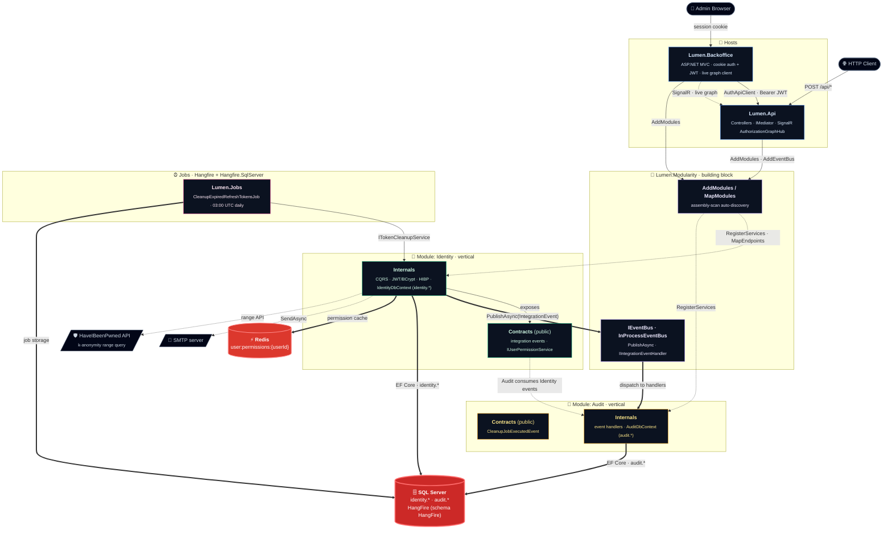

<h1 align="center">Lumen</h1>

<p align="center">
  <i>Identity & Access Management service in .NET 8 — a <b>modular monolith</b> (DDD, CQRS) with permission-based authorization, Redis caching, a real-time authorization graph over SignalR, and a Razor backoffice that consumes its own JWT API.</i>
</p>

<p align="center">
  <a href="https://github.com/KauaVilasBoas/Lumen/actions/workflows/ci.yml">
    
  </a>
  <a href="https://github.com/KauaVilasBoas/Lumen/releases">
    
  </a>
  
  <a href="https://www.conventionalcommits.org/">
    
  </a>
  <a href="LICENSE">
    
  </a>
</p>

---

## What is this?

Every multi-product company eventually rebuilds the same three answers: **who is this user**,
**what are they allowed to do**, and **who changed that permission, and when**. Lumen is a
standalone **Identity & Access Management (IAM)** service that answers all three — with an audit
trail and a **live authorization graph** that updates in real time as permissions change.

Under the hood: user registration with breached-password screening, JWT authentication with
refresh-token rotation, and a **permission-based authorization model** where permissions are
discovered from code, grouped into profiles, cached in Redis, and administered through an admin
console that pushes graph updates over SignalR the moment a user's permissions change.

It is built as a **modular monolith**: each business capability is a self-contained vertical
(`Identity`, `Audit`) that owns its domain, its CQRS application layer, its own `DbContext` and
SQL schema, and a small public **Contracts** assembly. Modules never reference each other's
internals — they talk only through Contracts and an **in-process event bus**. A reusable building
block, **`Lumen.Modularity`**, makes a module plug-and-play: mark a class `[Module]`, implement
`IModule`, and the host discovers it, registers its services, maps its endpoints and wires the bus
automatically.

### Highlights

- **Modular monolith, enforced by tests** — each module (`Identity`, `Audit`) is an isolated
  vertical. Cross-module communication is **only** via `*.Contracts` + an in-process `IEventBus`;
  **zero dependency on another module's internals**. Seven `NetArchTest` rules fail the build the
  moment a boundary is crossed.
- **`Lumen.Modularity` — a reusable building block** — `[Module]` + `IModule` +
  `AddModules`/`MapModules`/`AddEventBus`. The host auto-discovers modules by assembly scanning,
  registers their services, maps their endpoints and wires the event bus with no manual plumbing.
  It is domain-agnostic by design — built to be extracted as a standalone library.
- **CQRS via MediatR** — one file per use case; `Command`, `Result` and `Validator` are sealed
  records nested in the handler. FluentValidation runs in a pipeline behavior before any handler.
- **Permission-based authorization** — `[RequirePermission]` triggers discovery at startup, a
  dynamic `IAuthorizationPolicyProvider` enforces `Controller.Action` codes, and Redis caches
  resolved permission sets with event-driven invalidation. Never fails open.
- **Real-time authorization graph** — a SignalR hub pushes per-user graph deltas to the backoffice
  the moment a `UserPermissionsChanged` integration event flows across the bus.
- **Schema per module** — `identity.*` and `audit.*` are owned by separate `DbContext`s with their
  own EF migrations, applied at startup by per-module hosted services. No cross-schema foreign keys
  — cross-references are by `Guid` id.
- **Security by default** — BCrypt hashing, HaveIBeenPwned k-anonymity screening, account lockout,
  enumeration-resistant login, RFC 7807 error contracts, startup-validated configuration.
- **Operational maturity** — structured Serilog logging with correlation IDs, audit trail,
  Hangfire recurring jobs, health checks, soft-delete with filtered unique indexes,
  Testcontainers integration tests in CI.

---

## Demo

> 🚧 **Live demo coming soon** — the API and Backoffice will be deployed as long-running .NET
> containers on Railway (see [ADR-0001](docs/adr/0001-mongodb-to-relational-efcore.md) for the
> hosting decision).

| Service | URL |
|---|---|
| API | _pending deploy_ |
| Backoffice | _pending deploy_ |

---

## Screenshots

> 📸 _Coming with the first deploy — planned captures:_ the **live Authorization Graph**
> (SignalR pushing a permission change in real time), the **Backoffice overview**, the
> **profile → permission assignment** screen, **users management**, the **Hangfire dashboard**
> and the **email confirmation flow** in Mailpit.

<!--
  TODO: capture the images into docs/screenshots/ and uncomment.

| Authorization Graph (live · SignalR) | Backoffice Overview |
|---|---|
|  |  |

| Profile permission assignment | Users management |
|---|---|
|  |  |

| Hangfire dashboard | Email flow (Mailpit) |
|---|---|
|  |  |
-->


---

## Architecture at a glance



<sub><b>Reading the diagram</b> — hosts compose modules through <code>Lumen.Modularity</code> (auto-discovery + event bus); solid arrows are in-process synchronous flow · thick arrows are the event bus and SQL Server / Redis I/O paths · dashed arrows are module wiring, contract dependencies and external I/O. Each module (Identity = green, Audit = amber) is a self-contained vertical; the only thing they share is the other module's <b>Contracts</b> — never its internals.</sub>

---

## Engineering decisions

Each decision below was planned and tracked as a card on the
[Trello board](https://trello.com/b/2ZZ0yCf8/portifolio-projects); the larger ones have a
dedicated [ADR](docs/adr/).

| Decision | Rationale |
|---|---|
| **Modular monolith over technical layers** | The codebase migrated from a layered Clean Architecture (`Domain` · `Application` · `Infrastructure` · `Presentation`) to **business-capability modules** (`Identity`, `Audit`). Each module is a vertical slice that can be reasoned about, tested and — one day — extracted in isolation. The trade-off: more assemblies and explicit contracts, in exchange for hard isolation and a clear path to extraction. |
| **`Lumen.Modularity` building block** | A domain-agnostic library provides `[Module]`/`IModule`, assembly-scan auto-discovery (`AddModules`/`MapModules`) and an in-process `IEventBus` (`AddEventBus`). Adding a module to a host is two calls — no manual DI wiring per module. Built to become a reusable NuGet package across projects. |
| **Zero dependency on module internals** | Cross-module communication is allowed **only** through `*.Contracts` (integration events + public interfaces) and the event bus. A module never imports another module's internal namespaces. Seven `NetArchTest` rules enforce this at build time — violating a boundary fails the test build, not a code review. |
| **Schema + DbContext + migrations per module** | `Identity` owns `identity.*` via `IdentityDbContext`; `Audit` owns `audit.*` via `AuditDbContext`. Each module ships its own EF migrations, applied at startup by a hosted service. No cross-schema foreign keys — cross-references are by `Guid` id, which is what makes future extraction cheap. |
| **In-process event bus for integration events** | `Identity` publishes integration events (`UserLoggedIn`, `UserProfileAssigned`, `ProfilePermissionsSet`, `UserPermissionsChanged`…) via `IEventBus`; `Audit` and the live-graph push handler subscribe independently. `PublishAsync` opens a DI scope per publish, so scoped handlers (DbContext) work correctly under a singleton bus. |
| **CQRS via MediatR with nested types** | `Command`, `Result`, `Validator` are `sealed record`s nested inside the handler. One file = one use case, fully self-contained. No anemic DTO layer between Controller and Handler. CQRS buys per-use-case isolation and command-scoped pipeline behaviors; a separate read store is deliberately deferred until a measured load justifies its consistency cost. |
| **SQL Server + EF Core (relational authz)** | Migrated from MongoDB to SQL Server with EF Core 8 once the authorization model demanded relational integrity between User, Profile, Permission and token entities. The trade-off is documented in [ADR-0001](docs/adr/0001-mongodb-to-relational-efcore.md). |
| **Permission-based authorization, discovered from code** | `[RequirePermission]` on an API action derives a `Controller.Action` permission code, registers it at startup, and enforces it via a dynamic `IAuthorizationPolicyProvider`. Adding an endpoint never requires a manual permission insert. See [docs/authz.md](docs/authz.md). |
| **Profiles instead of roles** | Role claims are frozen at token issue time, so revocation only takes effect at expiry. Profiles are database-backed permission groupings resolved per request (Redis-cached), which makes permission changes — and revocations — effective immediately, without re-issuing tokens. |
| **Curated permissions via EF data migrations** | Initial business data (admin user, system profiles, seeded permissions) arrives exclusively through version-controlled data migrations inside the Identity module — no runtime seed scripts. See [ADR-0002](docs/adr/0002-admin-bootstrap-credential.md). |
| **Redis distributed permission cache** | Permission sets cached per user with event-driven invalidation (`UserPermissionsChanged`). When Redis is down, enforcement falls back to the database — authorization never fails open. |
| **Real-time authorization graph (SignalR)** | A typed hub (`Hub<IAuthorizationGraphHubClient>`) pushes per-user graph deltas to the backoffice when permissions change. The Identity module publishes one integration event; cache invalidation, audit and graph push react to it independently across the bus. |
| **Soft-delete everywhere** | No entity is ever physically deleted. EF Core global query filters hide deleted records; a filtered unique index on `Email`/`Username` (`WHERE IsDeleted = 0`) allows re-registration after soft-delete. |
| **Backoffice consumes its own public API** | The MVC backoffice authenticates against the API via a typed `AuthApiClient`, stores the JWT in a cookie session, and reuses the Identity module's permission model through `HasPermissionAsync` and a `RequirePermissionTagHelper`. The product eats its own dog food. |
| **Hangfire for recurring work** | The API hosts the Hangfire server; `CleanupExpiredRefreshTokensJob` runs daily at 03:00 UTC through the Identity module's `ITokenCleanupService` and publishes a `CleanupJobExecuted` event onto the bus. |
| **Quality gates in the build** | `TreatWarningsAsErrors` + `Nullable` enabled globally via `Directory.Build.props`; NuGet versions centralized in `Directory.Packages.props`; options validated with `ValidateOnStart()` — misconfiguration crashes on boot, never silently in production. |
| **RFC 7807 error contract** | A global `IExceptionHandler` maps `ValidationException` → `ValidationProblemDetails 400` and `ConflictException` → `ProblemDetails 409`. Consistent, machine-readable errors. |
| **Tests as a first-class deliverable** | 220+ xUnit test cases across module, building-block and architecture suites. The integration suite spins up real SQL Server and Redis via Testcontainers — no in-memory fakes for persistence behaviour. |

---

## Stack

| Layer | Technology |
|---|---|
| Runtime | .NET 8 / ASP.NET Core 8 |
| Modularity | `Lumen.Modularity` — `[Module]`/`IModule`, assembly-scan auto-discovery, in-process event bus |
| API | Controllers + MediatR (CQRS) + SignalR |
| Backoffice | ASP.NET Core MVC (Razor) |
| Auth | JWT Bearer + refresh tokens + permission-based authorization |
| Validation | FluentValidation 11 (MediatR pipeline behavior) |
| Database | SQL Server + EF Core 8 (schema per module, soft-delete, FK integrity within a module) |
| Cache | Redis (distributed permission cache, event-driven invalidation) |
| Background jobs | Hangfire + Hangfire.SqlServer |
| Email | MailKit (+ Mailpit for local dev) |
| Logging | Serilog (structured JSON in prod, correlation IDs) |
| Testing | xUnit + NSubstitute + FluentAssertions + Testcontainers (SQL Server + Redis) · NetArchTest |
| CI | GitHub Actions (build + unit + integration tests on every push/PR) |
| Local dev | Docker Compose (Mailpit + SQL Server + Redis) |

---

## API surface

| Area | Endpoints |
|---|---|
| Auth | `POST /api/auth/register` · `POST /api/auth/login` · `POST /api/auth/refresh` · `POST /api/auth/logout` · `POST /api/auth/forgot-password` · `POST /api/auth/reset-password` · `GET /api/auth/confirm-email` · `POST /api/auth/resend-confirmation` |
| Identity | `GET /api/me` |
| Users | `GET /api/users` · `GET /api/users/{id}` |
| Profiles | `GET/POST /api/profiles` · `GET/PUT/DELETE /api/profiles/{id}` · `PUT /api/profiles/{id}/permissions` |
| Permissions | `GET /api/permissions` |
| User profiles | `GET /api/user-profiles` · `POST/DELETE /api/user-profiles/{profileId}` |
| Authorization graph | `GET /api/authorization-graph` · SignalR hub `/hubs/authorization-graph` |
| Audit | `GET /api/audit/recent` |
| Diagnostics | `GET /api/diagnostics/cache-stats` · `GET /api/diagnostics/job-stats` |
| Health | `GET /health/db` |

Every non-anonymous endpoint is protected by a permission code (`401` unauthenticated,
`403` missing permission). Full model in [docs/authz.md](docs/authz.md); login/lockout
semantics in [docs/security.md](docs/security.md).

```powershell
# Register
curl -X POST http://localhost:5237/api/auth/register `
  -H "Content-Type: application/json" `
  -d '{"email":"you@example.com","username":"you","password":"Str0ng!Passw0rd-2026"}'

# Login (identifier accepts email or username)
curl -X POST http://localhost:5237/api/auth/login `
  -H "Content-Type: application/json" `
  -d '{"identifier":"you@example.com","password":"Str0ng!Passw0rd-2026"}'
# → { "accessToken": "<jwt>", "refreshToken": "<opaque>", "expiresIn": 900 }
```

---

## Getting started

### Prerequisites

- .NET 8 SDK
- Docker Desktop

### Run it

```powershell
# 1. Infrastructure: Mailpit (SMTP :1025 / UI :8025) + SQL Server (:1433) + Redis (:6379)
docker compose up -d

# 2. API — http://localhost:5237 / https://localhost:7068
#    Each module applies its own EF migrations at startup
#    (IdentityMigrationsHostedService → identity.* · AuditMigrationsHostedService → audit.*)
dotnet run --project src/Lumen.Api

# 3. Backoffice (optional)
dotnet run --project src/Presentation/Lumen.Backoffice
```

The Identity module's data migrations create the bootstrap admin (`admin@lumen.local`), the system
profiles `Administrator` / `User`, and the admin binding — see
[ADR-0002](docs/adr/0002-admin-bootstrap-credential.md) for the credential policy.

Connection strings, JWT settings, SMTP and all other options (with `dotnet user-secrets`
examples) are documented in **[docs/configuration.md](docs/configuration.md)**.

Production email is **SMTP-provider agnostic** — any provider (Brevo/SendGrid free tier,
self-hosted [Postal](https://docs.postalserver.io/), or any plain SMTP relay) plugs in via
`Smtp__*` environment variables, and a startup validator fails the boot in Production if
the SMTP config is missing, still a placeholder, or pointing at localhost. See the
[provider options](docs/configuration.md#production-smtp--fail-fast-validation).

### Tests

```powershell
# Module, building-block and architecture suites (no Docker required)
dotnet test tests/Lumen.Modules.Identity.Tests
dotnet test tests/Lumen.Modules.Audit.Tests
dotnet test tests/Lumen.Modularity.UnitTests
dotnet test tests/Lumen.ArchitectureTests
dotnet test tests/Lumen.UnitTests

# Include the test that calls the public HaveIBeenPwned API
dotnet test --filter "Category=ExternalApi"
```

> The Testcontainers integration suite (`Lumen.IntegrationTests`) spins up real SQL Server and
> Redis and runs in CI. It is currently being rewritten to target the per-module `IdentityDbContext`
> and is temporarily out of the solution — see the [Roadmap](#roadmap).

### Add a new module

Modules are plug-and-play through `Lumen.Modularity`:

```csharp
[Module]
public sealed class BillingModule : IModule
{
    public static Assembly Assembly => typeof(BillingModule).Assembly;

    public void RegisterServices(IServiceCollection services, IConfiguration configuration) { /* DI */ }
    public void MapEndpoints(IEndpointRouteBuilder endpoints) { /* routes */ }
}
```

```csharp
// Host — the only wiring needed:
builder.Services.AddModules(IdentityModule.Assembly, AuditModule.Assembly, BillingModule.Assembly);
builder.Services.AddEventBus(IdentityModule.Assembly, AuditModule.Assembly, BillingModule.Assembly);
// ...
app.MapModules();
```

---

## Engineering workflow

This repository is run like a production codebase — every significant decision was planned as a
card on a [public Trello board](https://trello.com/b/2ZZ0yCf8/portifolio-projects), implemented in
an atomic Conventional-Commits branch, delivered by PR, and recorded in the
[CHANGELOG](CHANGELOG.md) and [ADRs](docs/adr/):

- **[Semantic Versioning](https://semver.org/)** — releases are tagged (`vMAJOR.MINOR.PATCH`)
  and published on the [Releases page](https://github.com/KauaVilasBoas/Lumen/releases).
  The release badge at the top of this README always reflects the latest version; everything
  newer than it is visible in the [`Unreleased` section of the CHANGELOG](CHANGELOG.md).
- **[Keep a Changelog](https://keepachangelog.com/)** — every card lands with a CHANGELOG entry.
- **[Conventional Commits](https://www.conventionalcommits.org/)** — atomic commits
  (`feat:`, `fix:`, `refactor:`, `test:`, `docs:`…) delivered through feature branches and PRs;
  `main` only moves by merge.
- **Task-first development** — every feature, fix and decision starts as a card on the
  [public Trello board](https://trello.com/b/2ZZ0yCf8/portifolio-projects) with acceptance
  criteria, then becomes a branch, then a PR.
- **ADRs** — significant architectural choices are recorded in [docs/adr/](docs/adr/).
- **CI on every push** — GitHub Actions builds the full solution with
  `TreatWarningsAsErrors` and runs the unit + Testcontainers integration suites.

---

## Documentation

| Document | Contents |
|---|---|
| [docs/authz.md](docs/authz.md) | Authorization model: entities, discovery, enforcement, soft-delete, `/me` contract |
| [docs/security.md](docs/security.md) | Password policy, HIBP k-anonymity integration, login semantics, fail-safe behaviour |
| [docs/configuration.md](docs/configuration.md) | Every environment variable, user-secrets setup, logging and correlation IDs |
| [docs/adr/0001](docs/adr/0001-mongodb-to-relational-efcore.md) | ADR: MongoDB → SQL Server + EF Core, Railway as deploy target |
| [docs/adr/0002](docs/adr/0002-admin-bootstrap-credential.md) | ADR: admin bootstrap credential via data migration |
| [docs/adr/0003](docs/adr/0003-layered-to-modular-monolith.md) | ADR: layered Clean Architecture → modular monolith (`Lumen.Modularity`) |
| [CHANGELOG.md](CHANGELOG.md) | Full release history (Keep a Changelog) |

---

## Roadmap

| Item | Status |
|---|---|
| Migration to a modular monolith (`Lumen.Modularity` + `Identity`/`Audit` modules) | Shipped |
| Email confirmation & resend (`GET /api/auth/confirm-email`, `POST /api/auth/resend-confirmation`) | Shipped |
| Rewrite `Lumen.IntegrationTests` for per-module `IdentityDbContext` | In progress |
| Extract `Lumen.Modularity` as a standalone NuGet package | Planned |
| Per-IP rate limiting on auth endpoints | Planned |
| Public deploy on Railway (API + Backoffice) | Planned |
| OpenAPI / Swagger documentation | Planned |
| Forced password rotation for the bootstrap admin | Planned |

The live backlog — including every completed card — is on the
[Trello board](https://trello.com/b/2ZZ0yCf8/portifolio-projects).

---

## Author

**Kauã Vilas Boas** — Backend / Full-Stack Developer (.NET · C#)

<p>
  <a href="https://www.linkedin.com/in/kauavilasboas/">
    
  </a>
  <a href="https://github.com/KauaVilasBoas">
    
  </a>
  <a href="mailto:kauavboas@gmail.com">
    
  </a>
</p>

Based in Brazil (UTC−3) — full overlap with US East Coast and European afternoon working hours.
Open to remote opportunities.

---

## License

[MIT](LICENSE)
