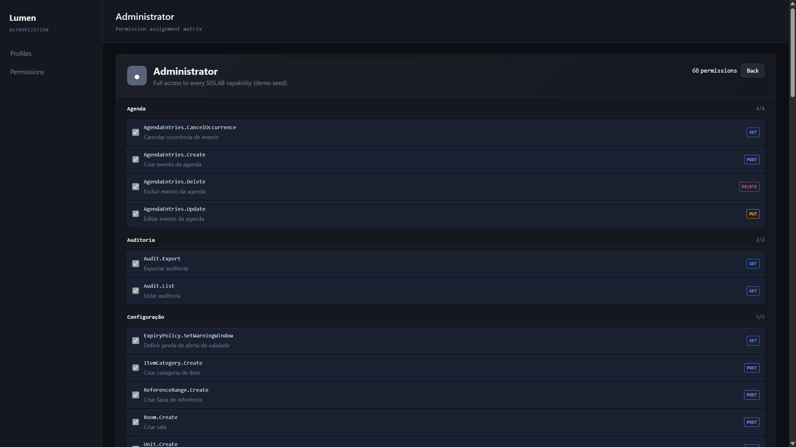
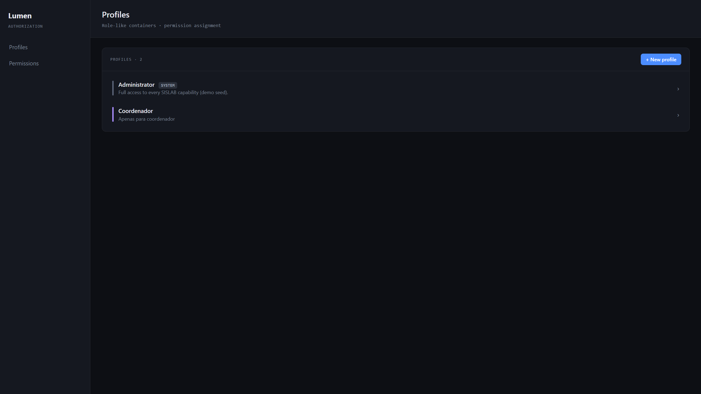
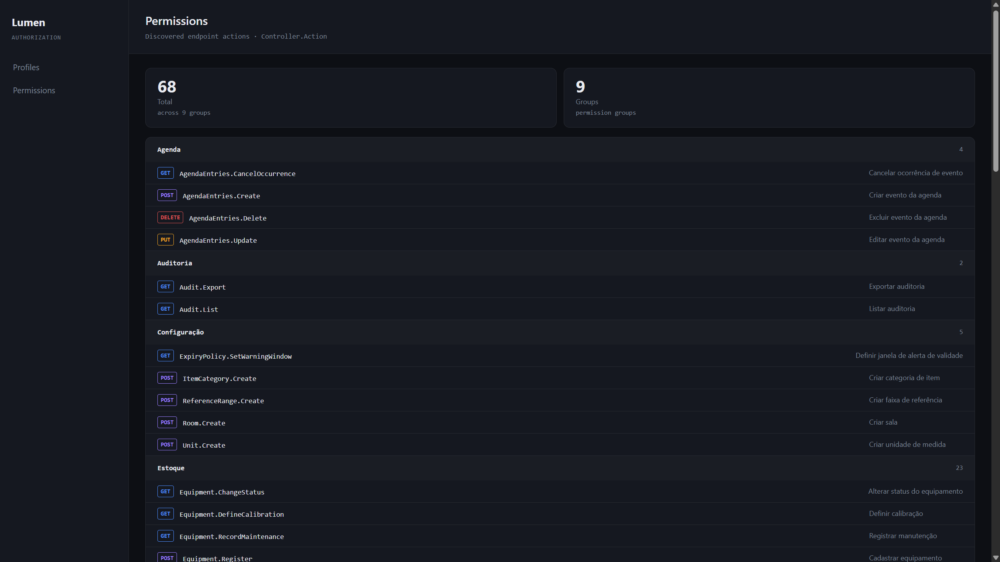
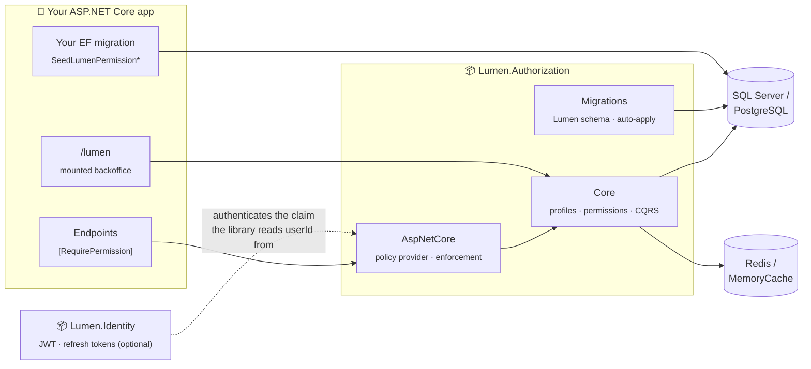

<h1 align="center">Lumen</h1>

<p align="center">
  <i>Plug-in <b>authorization & identity libraries</b> for ASP.NET Core (.NET 8) — permission-based access control with a mountable admin backoffice, a consumer-owned permission catalog, and SQL Server / PostgreSQL support.</i>
</p>

<p align="center">
  <a href="https://github.com/KauaVilasBoas/Lumen/actions/workflows/ci.yml">
    
  </a>
  <a href="https://www.nuget.org/packages/Lumen.Authorization">
    
  </a>
  <a href="https://www.nuget.org/packages/Lumen.Identity">
    
  </a>
  <a href="https://www.nuget.org/profiles/kauavilasboas">
    
  </a>
  <a href="LICENSE">
    
  </a>
</p>

---

## What is this?

Most ASP.NET Core apps end up hand-rolling the same thing: a `Permissions` table, a join to
roles, an `[Authorize]` policy per endpoint, and a half-finished admin screen to manage it all.
**Lumen packages that as a library** — decorate an action with `[RequirePermission]`, mount an
admin console at `/lumen`, and keep full ownership of your permission catalog.

Two package families, published on [NuGet](https://www.nuget.org/profiles/kauavilasboas):

- **`Lumen.Authorization`** *(flagship)* — permission-based authorization: profiles (roles),
  permissions, groups, user↔profile assignments, enforcement, caching, and a mountable
  backoffice UI.
- **`Lumen.Identity`** *(companion)* — authentication: registration, login, JWT +
  refresh-token rotation, email confirmation, password reset — pre-wired to plug into
  Authorization.

### Four inviolable principles (v3.0)

The library is **generic by contract** ([ADR-0007](docs/adr/0007-authz-3.0-generic-library.md), [SPEC-0001](docs/spec/0001-lumen-authorization-3.0-generic.md)):

1. **Zero auto-population** — tables start empty; the library creates the schema, nothing else.
2. **Zero global enforcement** — it only blocks where you place `[RequirePermission]`.
3. **Zero identity coupling** — no `Users` table; `userId` is an opaque `Guid` read from a configurable claim.
4. **Zero consumer-specific code** — the library knows nothing about your application.

Battle-tested as the AuthN/AuthZ backbone of a multi-tenant laboratory management system —
which drove [tenant-scoped permissions (ADR-0006)](docs/adr/0006-authz-tenant-scoped-permissions.md)
and the [PostgreSQL provider (ADR-0005)](docs/adr/0005-multi-provider-database-support.md).

---

## Quick start

```powershell
dotnet add package Lumen.Authorization.AspNetCore   # core + enforcement + migrations
dotnet add package Lumen.Authorization.Backoffice   # optional: mountable admin UI
```

**1. Wire it up** — one call registers the core, `[RequirePermission]` enforcement, and the
hosted service that creates/updates the `Lumen` schema on boot:

```csharp
builder.Services.AddLumenAuthorization(connectionString, options =>
{
    options.Provider = DatabaseProvider.PostgreSQL;      // default: SqlServer
    options.RedisConnectionString = redisConnection;     // optional — falls back to MemoryCache
    options.UserIdClaimType = "sub";                     // default: ClaimTypes.NameIdentifier
});

builder.Services.AddLumenBackoffice();                   // optional admin console

app.UseAuthentication();
app.UseAuthorization();
app.MapLumenBackoffice("/lumen");
```

**2. Protect endpoints** — nothing is blocked unless you say so:

```csharp
[RequirePermission]                      // convention: code = "Controller.Action"
public IActionResult Index() { ... }

[RequirePermission("Profiles.Delete")]   // explicit code
public IActionResult Delete(Guid id) { ... }
```

**3. Seed your catalog** — permissions are *yours*, versioned in your own EF migration via the
provided helpers (the library never seeds anything):

```csharp
public partial class SeedPermissions : Migration
{
    protected override void Up(MigrationBuilder migrationBuilder)
    {
        migrationBuilder.SeedLumenPermissionGroup("Inventory", "Stock and equipment management");
        migrationBuilder.SeedLumenPermission("Inventory.View", "View inventory", "Inventory");
        migrationBuilder.SeedLumenPermission("Inventory.Manage", "Manage inventory", "Inventory");

        migrationBuilder.SeedLumenPermission(
            LumenBackofficePermissions.ProfilesManage, "Manage profiles", "Lumen Backoffice");
    }
}
```

That's it — a missing permission means a `403`, never a boot failure.

---

## Backoffice

The optional `Lumen.Authorization.Backoffice` package is a Razor Class Library that mounts a
full admin console inside **your** app at any prefix — profiles, permission catalog, groups
and user↔profile assignments — gated by its own `LumenBackofficePermissions.*` codes.



| Profiles | Permission catalog & groups |
|---|---|
|  |  |

---

## Packages

| Package | Purpose |
|---|---|
| [`Lumen.Authorization`](https://www.nuget.org/packages/Lumen.Authorization) | Core: domain, CQRS handlers, EF Core persistence (SQL Server + PostgreSQL) |
| [`Lumen.Authorization.AspNetCore`](https://www.nuget.org/packages/Lumen.Authorization.AspNetCore) | `[RequirePermission]`, dynamic policy provider, umbrella `AddLumenAuthorization()` |
| [`Lumen.Authorization.Backoffice`](https://www.nuget.org/packages/Lumen.Authorization.Backoffice) | Mountable admin UI (Razor Class Library) — `MapLumenBackoffice("/lumen")` |
| [`Lumen.Authorization.Contracts`](https://www.nuget.org/packages/Lumen.Authorization.Contracts) | Public interfaces (`IUserPermissionService`, `IUserIdAccessor`) and events |
| [`Lumen.Authorization.Migrations`](https://www.nuget.org/packages/Lumen.Authorization.Migrations) | SQL Server migrations + `SeedLumenPermission*` helpers |
| [`Lumen.Authorization.Migrations.PostgreSQL`](https://www.nuget.org/packages/Lumen.Authorization.Migrations.PostgreSQL) | PostgreSQL migrations (snake_case) + seed helpers |
| [`Lumen.Identity`](https://www.nuget.org/packages/Lumen.Identity) | AuthN core: user domain, JWT/BCrypt/MailKit, bridges into Authorization |
| [`Lumen.Identity.AspNetCore`](https://www.nuget.org/packages/Lumen.Identity.AspNetCore) | `AddLumenIdentity()` + minimal-API endpoints (`MapLumenIdentityEndpoints()`) |
| [`Lumen.Identity.Migrations`](https://www.nuget.org/packages/Lumen.Identity.Migrations) / [`.PostgreSQL`](https://www.nuget.org/packages/Lumen.Identity.Migrations.PostgreSQL) | `identity` schema migrations per provider |

### How it plugs in



The library owns the `Lumen` schema and the enforcement pipeline; **you** own the catalog,
the identity provider and every enforcement point.

---

## Lumen.Identity (companion)

Drop-in authentication for hosts that don't have an identity provider yet — built on the same
principles and pre-integrated with Authorization:

```csharp
builder.Services.AddLumenIdentity(builder.Configuration);   // AuthN core + JWT Bearer + migrations

app.UseAuthentication();
app.UseAuthorization();
app.MapLumenIdentityEndpoints("/api/auth");
```

Ships minimal-API endpoints for register / login / refresh / logout / me / confirm-email /
forgot- & reset- & change-password. Security posture: BCrypt hashing, refresh-token rotation
with revoke-on-password-change, SHA-256-hashed one-time tokens, enumeration-resistant
responses, account lockout.

---

## Engineering decisions

Full history in [ADRs](docs/adr/) and [SPEC-0001](docs/spec/0001-lumen-authorization-3.0-generic.md); the ones that define the library:

| Decision | Rationale |
|---|---|
| **Library, not framework** ([ADR-0004](docs/adr/0004-authorization-as-library.md) → [ADR-0007](docs/adr/0007-authz-3.0-generic-library.md)) | v2.x auto-discovered `[RequirePermission]` and synced the catalog at boot. v3.0 deleted that machine: convenience wasn't worth the library holding opinions about consumer code. The four zero-principles are now the contract. |
| **Consumer-owned catalog** | Permissions arrive exclusively through the consumer's own version-controlled EF migrations (`SeedLumenPermission*` helpers). Reviewable, diffable, environment-reproducible — never mutated at boot. |
| **Profiles instead of roles** | Role claims freeze at token issue time, so revocation waits for expiry. Profiles are DB-backed groupings resolved per request (cached) — permission changes and revocations take effect immediately, no token re-issue. |
| **Multi-provider by migration assembly** ([ADR-0005](docs/adr/0005-multi-provider-database-support.md)) | One core, provider-specific migration packages (SQL Server, PostgreSQL snake_case). `options.Provider` selects the assembly; a hosted service applies migrations on boot (opt-out flag). |
| **Fail closed, degrade gracefully** | Redis is an optional cache with event-driven invalidation; when it's down, enforcement falls back to the database. Authorization never fails open. |
| **Backoffice as a Razor Class Library** | The admin console ships *inside* the consumer's process — no separate deploy, mounted at any prefix, protected by the same permission model it manages (public `LumenBackofficePermissions` constants). |
| **Boundaries enforced by tests** | 12 `NetArchTest` rules fail the build if a `Lumen.Authorization*` assembly touches app code or the core touches ASP.NET Core. The architecture is tested, not documented. |

---

## Stack

<p>
  
  
  
  
  
  
  
  
  
  
  
  
</p>

---

## Engineering workflow

This repository is run like a production codebase:

- **[SemVer](https://semver.org/) per package family** — independent release lines tagged
  `authorization-v*` / `identity-v*`, each with GitHub Releases and a
  [Keep a Changelog](https://keepachangelog.com/) [CHANGELOG](CHANGELOG.md) including full
  **2.x → 3.0 migration guides**.
- **NuGet Trusted Publishing (OIDC)** — packages are published by tag-triggered GitHub Actions
  using short-lived OIDC tokens; no long-lived API keys anywhere.
- **[Conventional Commits](https://www.conventionalcommits.org/)** — atomic commits through
  feature branches and PRs; `main` only moves by merge.
- **ADRs + SPEC** — every significant decision is recorded in [docs/adr/](docs/adr/); the 3.0
  contract lives in [docs/spec/](docs/spec/).
- **CI on every push** — full build with `TreatWarningsAsErrors`, unit + architecture suites.

---

## Documentation

| Document | Contents |
|---|---|
| [SPEC-0001](docs/spec/0001-lumen-authorization-3.0-generic.md) | The 3.0 contract: principles, API surface, schema, seeding, backoffice gating |
| [ADR-0004](docs/adr/0004-authorization-as-library.md) | Extracting authorization from a monolith into a pluggable library |
| [ADR-0005](docs/adr/0005-multi-provider-database-support.md) | Multi-provider database support (SQL Server + PostgreSQL) |
| [ADR-0006](docs/adr/0006-authz-tenant-scoped-permissions.md) | Tenant-scoped permissions for multi-tenant consumers |
| [ADR-0007](docs/adr/0007-authz-3.0-generic-library.md) | 3.0: removing the auto-catalog machine, the four zero-principles |
| [CHANGELOG](CHANGELOG.md) | Release history per family, including breaking-change migration guides |

---

## Roadmap

| Item | Status |
|---|---|
| Authorization extracted from the monolith as a pluggable library (1.x) | ✅ Shipped |
| PostgreSQL provider + per-provider migration packages (2.0) | ✅ Shipped |
| Tenant-scoped permissions (`ITenantScopeAccessor`) | ✅ Shipped |
| Generic 3.0: zero auto-population / enforcement / identity coupling | ✅ Shipped |
| Mountable backoffice RCL + `LumenBackofficePermissions` | ✅ Shipped |
| `Lumen.Identity` 1.0 — companion AuthN library | ✅ Shipped |
| First-class minimal-API enforcement (`RequirePermission` endpoint filters) | Planned |
| MySQL / SQLite migration packages (same pattern as PostgreSQL) | Planned |
| ASP.NET Core Identity adapter (`IUserDirectory` / `IAuthorizationUserSource` bridge) | Planned |
| Audit-trail package (who changed which permission, when) | Planned |
| Backoffice localization (en / pt-BR) | Planned |
| .NET 10 target on GA | Planned |

---

## Author

**Kauã Vilas Boas** — Backend Engineer (.NET · C#) · builds and publishes production-grade
.NET libraries with documented architecture, independent release lines and CI/CD to NuGet.

<p>
  <a href="https://www.linkedin.com/in/kauavilasboas/">
    
  </a>
  <a href="https://github.com/KauaVilasBoas">
    
  </a>
  <a href="https://www.nuget.org/profiles/kauavilasboas">
    
  </a>
  <a href="mailto:kauavboas@gmail.com">
    
  </a>
</p>

Based in Brazil (UTC−3) — full overlap with US East Coast and European afternoon working hours.
Open to remote opportunities.

---

## License

[MIT](LICENSE)
