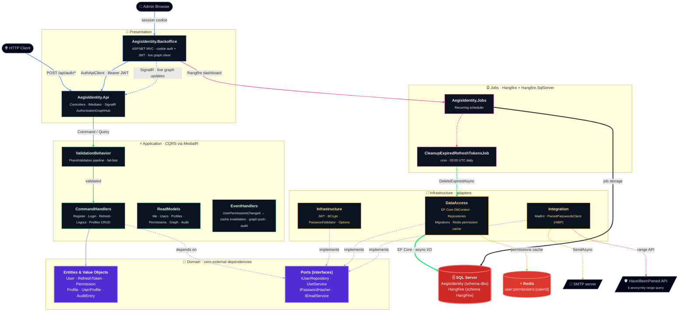

<h1 align="center">AegisIdentity</h1>

<p align="center">
  <i>Identity & Access Management service in .NET 8 — Clean Architecture, CQRS, permission-based authorization with Redis caching, a real-time authorization graph over SignalR, and a Razor backoffice that consumes its own JWT API.</i>
</p>

<p align="center">
  <a href="https://github.com/KauaVilasBoas/AegisIdentity/actions/workflows/ci.yml">
    
  </a>
  <a href="https://github.com/KauaVilasBoas/AegisIdentity/releases">
    
  </a>
  
  <a href="https://www.conventionalcommits.org/">
    
  </a>
  <a href="LICENSE">
    
  </a>
</p>

---

## What is this?

AegisIdentity is a standalone **Identity & Access Management (IAM)** service: user registration with
breached-password screening, JWT authentication with refresh-token rotation, and a
**permission-based authorization model** where permissions are discovered from code, grouped into
profiles, cached in Redis, and administered through a backoffice — including a **live authorization
graph** pushed over SignalR whenever a user's permissions change.

It is a portfolio project built to demonstrate **end-to-end architectural decision-making on a
non-trivial domain** — not another tutorial CRUD. Every significant decision was planned as a card on a
[public Trello board](https://trello.com/b/2ZZ0yCf8/portifolio-projects), implemented in an atomic
Conventional-Commits branch, delivered by PR, and recorded in the
[CHANGELOG](CHANGELOG.md) and [ADRs](docs/adr/).

### Highlights

- **Clean Architecture, enforced by the compiler** — Domain has zero external references; all
  infrastructure contracts (ports) live in Domain and adapters are wired by DI.
- **CQRS via MediatR** — one file per use case; `Command`, `Result` and `Validator` are sealed
  records nested in the handler. FluentValidation runs in a pipeline behavior before any handler.
- **Permission-based authorization** — `[RequirePermission]` triggers discovery at startup, a
  dynamic `IAuthorizationPolicyProvider` enforces `Controller.Action` codes, and Redis caches
  resolved permission sets with event-driven invalidation. Never fails open.
- **Real-time authorization graph** — a SignalR hub pushes per-user graph deltas to the backoffice
  the moment a `UserPermissionsChanged` event fires.
- **Security by default** — BCrypt hashing, HaveIBeenPwned k-anonymity screening, account lockout,
  enumeration-resistant login, RFC 7807 error contracts, startup-validated configuration.
- **Operational maturity** — structured Serilog logging with correlation IDs, audit trail,
  Hangfire recurring jobs, health checks, soft-delete with filtered unique indexes,
  Testcontainers integration tests in CI.

---

## Demo

> 🚧 **Live demo coming soon** — the API and Backoffice will be deployed as long-running .NET
> containers on Railway (see [ADR-0001](docs/adr/0001-mongodb-to-relational-efcore.md) for the
> hosting decision).

| Service | URL |
|---|---|
| API | _pending deploy_ |
| Backoffice | _pending deploy_ |

---

## Screenshots

> 📸 _Coming with the first deploy — planned captures:_ the **live Authorization Graph**
> (SignalR pushing a permission change in real time), the **Backoffice overview**, the
> **profile → permission assignment** screen, **users management**, the **Hangfire dashboard**
> and the **email confirmation flow** in Mailpit.

<!--
  TODO: capture the images into docs/screenshots/ and uncomment.

| Authorization Graph (live · SignalR) | Backoffice Overview |
|---|---|
|  |  |

| Profile permission assignment | Users management |
|---|---|
|  |  |

| Hangfire dashboard | Email flow (Mailpit) |
|---|---|
|  |  |
-->


---

## Architecture at a glance



<sub><b>Reading the diagram</b> — solid arrows are in-process synchronous flow · dashed arrows are port/adapter wiring and external I/O · thick arrows are SQL Server / Redis I/O paths · Domain (purple) has zero outgoing dependencies; every other layer depends inward on it.</sub>

---

## Engineering decisions

Each decision below was planned and tracked as a card on the
[Trello board](https://trello.com/b/2ZZ0yCf8/portifolio-projects); the larger ones have a
dedicated [ADR](docs/adr/).

| Decision | Rationale |
|---|---|
| **Multi-solution Clean Architecture** | Six layer solutions (`Domain` · `Application` · `Infrastructure` · `Presentation` · `Jobs` · `SharedKernel`) aggregated by a root `.sln`. Each layer can be opened, built and reasoned about in isolation. |
| **CQRS via MediatR with nested types** | `Command`, `Result`, `Validator` are `sealed record`s nested inside the handler. One file = one use case, fully self-contained. No anemic DTO layer between Controller and Handler. |
| **Ports & Adapters (Dependency Inversion)** | All infrastructure contracts (`IUserRepository`, `IJwtService`, `IEmailService`, `IPasswordHasher`…) live in **Domain**. Adapters are wired by DI — Domain has zero external references, verified by the compiler. |
| **SQL Server + EF Core (relational authz)** | Migrated from MongoDB to SQL Server with EF Core 8 once the authorization model demanded relational integrity between User, Profile, Permission and token entities. The trade-off is documented in [ADR-0001](docs/adr/0001-mongodb-to-relational-efcore.md). |
| **Permission-based authorization, discovered from code** | `[RequirePermission]` on an API action derives a `Controller.Action` permission code, registers it at startup, and enforces it via a dynamic `IAuthorizationPolicyProvider`. Adding an endpoint never requires a manual permission insert. See [docs/authz.md](docs/authz.md). |
| **Curated permissions via EF data migrations** | Initial business data (admin user, system profiles, seeded permissions) arrives exclusively through version-controlled data migrations — no runtime seed scripts. See [ADR-0002](docs/adr/0002-admin-bootstrap-credential.md). |
| **Redis distributed permission cache** | Permission sets cached per user with event-driven invalidation (`UserPermissionsChanged`). When Redis is down, enforcement falls back to the database — authorization never fails open. |
| **Real-time authorization graph (SignalR)** | A typed hub (`Hub<IAuthorizationGraphHubClient>`) pushes per-user graph deltas to the backoffice when permissions change. MediatR fans the same notification out to cache invalidation, audit and graph push handlers independently. |
| **Soft-delete everywhere** | No entity is ever physically deleted. EF Core global query filters hide deleted records; a filtered unique index on `Email`/`Username` (`WHERE IsDeleted = 0`) allows re-registration after soft-delete. |
| **Backoffice consumes its own public API** | The MVC backoffice authenticates against the API via a typed `AuthApiClient`, stores the JWT in a cookie session, and reuses the same permission model through `HasPermissionAsync` and a `RequirePermissionTagHelper`. The product eats its own dog food. |
| **Hangfire for recurring work** | The API hosts the Hangfire server; `CleanupExpiredRefreshTokensJob` runs daily at 03:00 UTC through the same `IRefreshTokenRepository` port as the rest of the app. |
| **Quality gates in the build** | `TreatWarningsAsErrors` + `Nullable` enabled globally via `Directory.Build.props`; NuGet versions centralized in `Directory.Packages.props`; options validated with `ValidateOnStart()` — misconfiguration crashes on boot, never silently in production. |
| **RFC 7807 error contract** | A global `IExceptionHandler` maps `ValidationException` → `ValidationProblemDetails 400` and `ConflictException` → `ProblemDetails 409`. Consistent, machine-readable errors. |
| **Tests as a first-class deliverable** | ~500 xUnit test cases. The integration suite spins up real SQL Server and Redis via Testcontainers — no in-memory fakes for persistence behaviour. |

---

## Stack

| Layer | Technology |
|---|---|
| Runtime | .NET 8 / ASP.NET Core 8 |
| API | Controllers + MediatR (CQRS) + SignalR |
| Backoffice | ASP.NET Core MVC (Razor) |
| Auth | JWT Bearer + refresh tokens + permission-based authorization |
| Validation | FluentValidation 11 (MediatR pipeline behavior) |
| Database | SQL Server + EF Core 8 (migrations, soft-delete, FK integrity) |
| Cache | Redis (distributed permission cache, event-driven invalidation) |
| Background jobs | Hangfire + Hangfire.SqlServer |
| Email | MailKit (+ Mailpit for local dev) |
| Logging | Serilog (structured JSON in prod, correlation IDs) |
| Testing | xUnit + Testcontainers (SQL Server + Redis) |
| CI | GitHub Actions (build + unit + integration tests on every push/PR) |
| Local dev | Docker Compose (Mailpit + SQL Server + Redis) |

---

## API surface

| Area | Endpoints |
|---|---|
| Auth | `POST /api/auth/register` · `POST /api/auth/login` · `POST /api/auth/refresh` · `POST /api/auth/logout` |
| Identity | `GET /api/me` |
| Users | `GET /api/users` · `GET /api/users/{id}` |
| Profiles | `GET/POST /api/profiles` · `GET/PUT/DELETE /api/profiles/{id}` · `PUT /api/profiles/{id}/permissions` |
| Permissions | `GET /api/permissions` |
| User profiles | `GET /api/user-profiles` · `POST/DELETE /api/user-profiles/{profileId}` |
| Authorization graph | `GET /api/authorization-graph` · SignalR hub `/hubs/authorization-graph` |
| Audit | `GET /api/audit/recent` |
| Diagnostics | `GET /api/diagnostics/cache-stats` · `GET /api/diagnostics/job-stats` |
| Health | `GET /health/db` |

Every non-anonymous endpoint is protected by a permission code (`401` unauthenticated,
`403` missing permission). Full model in [docs/authz.md](docs/authz.md); login/lockout
semantics in [docs/security.md](docs/security.md).

```powershell
# Register
curl -X POST http://localhost:5237/api/auth/register `
  -H "Content-Type: application/json" `
  -d '{"email":"you@example.com","username":"you","password":"Str0ng!Passw0rd-2026"}'

# Login (identifier accepts email or username)
curl -X POST http://localhost:5237/api/auth/login `
  -H "Content-Type: application/json" `
  -d '{"identifier":"you@example.com","password":"Str0ng!Passw0rd-2026"}'
# → { "accessToken": "<jwt>", "refreshToken": "<opaque>", "expiresIn": 900 }
```

---

## Getting started

### Prerequisites

- .NET 8 SDK
- Docker Desktop

### Run it

```powershell
# 1. Infrastructure: Mailpit (SMTP :1025 / UI :8025) + SQL Server (:1433) + Redis (:6379)
docker compose up -d

# 2. Database: EF Core migrations (also applied automatically at startup)
dotnet run --project src/Migrations/AegisIdentity.Migrations.Cli

# 3. API — http://localhost:5237 / https://localhost:7068
dotnet run --project src/AegisIdentity.Api

# 4. Backoffice (optional)
dotnet run --project src/Presentation/AegisIdentity.Backoffice
```

The data migrations create the bootstrap admin (`admin@aegisidentity.local`), the system
profiles `Administrator` / `User`, and the admin binding — see
[ADR-0002](docs/adr/0002-admin-bootstrap-credential.md) for the credential policy.

Connection strings, JWT settings, SMTP and all other options (with `dotnet user-secrets`
examples) are documented in **[docs/configuration.md](docs/configuration.md)**.

### Tests

```powershell
# Unit + integration (Testcontainers spins up real SQL Server and Redis)
dotnet test

# Include the test that calls the public HaveIBeenPwned API
dotnet test --filter "Category=ExternalApi"
```

---

## Engineering workflow

This repository is run like a production codebase:

- **[Semantic Versioning](https://semver.org/)** — releases are tagged (`vMAJOR.MINOR.PATCH`)
  and published on the [Releases page](https://github.com/KauaVilasBoas/AegisIdentity/releases).
  The release badge at the top of this README always reflects the latest version; everything
  newer than it is visible in the [`Unreleased` section of the CHANGELOG](CHANGELOG.md).
- **[Keep a Changelog](https://keepachangelog.com/)** — every card lands with a CHANGELOG entry.
- **[Conventional Commits](https://www.conventionalcommits.org/)** — atomic commits
  (`feat:`, `fix:`, `refactor:`, `test:`, `docs:`…) delivered through feature branches and PRs;
  `main` only moves by merge.
- **Task-first development** — every feature, fix and decision starts as a card on the
  [public Trello board](https://trello.com/b/2ZZ0yCf8/portifolio-projects) with acceptance
  criteria, then becomes a branch, then a PR.
- **ADRs** — significant architectural choices are recorded in [docs/adr/](docs/adr/).
- **CI on every push** — GitHub Actions builds the full solution with
  `TreatWarningsAsErrors` and runs the unit + Testcontainers integration suites.

---

## Documentation

| Document | Contents |
|---|---|
| [docs/authz.md](docs/authz.md) | Authorization model: entities, discovery, enforcement, soft-delete, `/me` contract |
| [docs/security.md](docs/security.md) | Password policy, HIBP k-anonymity integration, login semantics, fail-safe behaviour |
| [docs/configuration.md](docs/configuration.md) | Every environment variable, user-secrets setup, logging and correlation IDs |
| [docs/adr/0001](docs/adr/0001-mongodb-to-relational-efcore.md) | ADR: MongoDB → SQL Server + EF Core, Railway as deploy target |
| [docs/adr/0002](docs/adr/0002-admin-bootstrap-credential.md) | ADR: admin bootstrap credential via data migration |
| [CHANGELOG.md](CHANGELOG.md) | Full release history (Keep a Changelog) |

---

## Roadmap

| Item | Status |
|---|---|
| Email confirmation endpoint (`GET /api/auth/confirm-email`) | Planned |
| Per-IP rate limiting on auth endpoints | Planned |
| Public deploy on Railway (API + Backoffice) | Planned |
| OpenAPI / Swagger documentation | Planned |
| Forced password rotation for the bootstrap admin | Planned |

The live backlog — including every completed card — is on the
[Trello board](https://trello.com/b/2ZZ0yCf8/portifolio-projects).

---

## License

[MIT](LICENSE)
